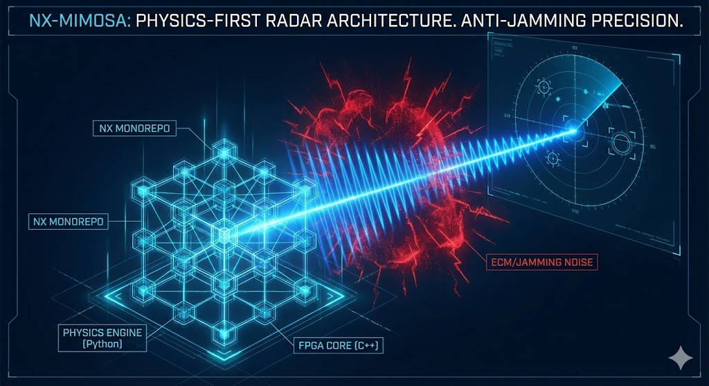

# NX-MIMOSA

<p align="center">
  
</p>

### Adaptive Multi-Sensor Multi-Target Tracker for Radar, EO/IR, ESM, and ADS-B

<p align="center">
  <strong>One parameter. Any sensor. Any domain. 3D multi-target. 8.6× more accurate than the nearest open-source alternative.</strong>
</p>

[]()
[]()
[]()
[]()
[]()
[]()
[]()
[](https://www.gnu.org/licenses/agpl-3.0)

**Nexellum d.o.o.** — Dr. Mladen Mešter — [mladen@nexellum.com](mailto:mladen@nexellum.com)

---

## 🚀 v5.0 — Full 3D Multi-Target Tracker

**Four critical capabilities added in v5.0:**

| Capability | Status | What It Means |
|-----------|--------|--------------|
| **3D Tracking** | ✅ NEW | Full [x,y,z,vx,vy,vz] state vector. CV3D, CA3D, CT3D motion models. IMM bank in 3D. |
| **Multi-Target (GNN + JPDA)** | ✅ NEW | Track N targets simultaneously. Hungarian algorithm (GNN) + Joint Probabilistic DA (JPDA). |
| **Track Management** | ✅ NEW | M-of-N init/confirm/delete. Tentative→Confirmed→Coasting→Deleted lifecycle. |
| **Coordinate Transforms** | ✅ NEW | WGS-84 ↔ ECEF ↔ ENU ↔ Spherical. Unbiased conversion (Bar-Shalom). EKF Jacobians. |
| **SIAP Metrics** | ✅ NEW | OSPA, NEES, NIS, completeness, purity, spuriousness (NATO standard). |
| **Domain Presets** | ✅ NEW | military, atc, automotive, space, maritime — one parameter auto-tunes everything. |

```python
from nx_mimosa_mtt import MultiTargetTracker

mtt = MultiTargetTracker(dt=1.0, r_std=50.0, domain="military", association="jpda")

for scan in radar_scans:
    confirmed_tracks = mtt.process_scan(measurements_3d)
    for track in confirmed_tracks:
        print(f"Track {track.track_id}: pos={track.filter.position}, vel={track.filter.velocity}")
```

---

## The Problem

Every radar system needs a tracker. The options today are:

| Option | Cost | Accuracy | Real-Time | Multi-Sensor | Configuration |
|--------|------|----------|-----------|-------------|---------------|
| MATLAB Sensor Fusion Toolbox | $5,000+/seat/year | Good | No native FPGA | Yes | 20+ parameters |
| Stone Soup (UK DSTL) | Free (MIT) | Baseline | Slow | Research-grade | Expert required |
| FilterPy | Free (MIT) | Basic | Fast | No | Manual |
| Custom in-house | $500K–$2M dev | Variable | Maybe | Maybe | 6–18 months |
| Defense primes (Raytheon, LM) | $10M+ program | Classified | Yes | Yes | Years |

Every option requires either deep tracking expertise, massive budgets, or both.

## The Solution

NX-MIMOSA replaces weeks of filter tuning with a single parameter:

```python
from nx_mimosa_v40_sentinel import NxMimosaV40Sentinel

tracker = NxMimosaV40Sentinel(dt=1.0, r_std=50.0, domain="military")
# That's it. 6-model IMM, adaptive Q, platform identification, ECM detection — all auto-configured.

for measurement in radar_detections:
    position, covariance, intent = tracker.update(measurement)
```

Add a second sensor in 3 lines:

```python
from nx_mimosa_fusion import MultiSensorFusionEngine, make_eo_sensor, SensorMeasurement

fusion = MultiSensorFusionEngine()
fusion.add_sensor(make_eo_sensor("flir", az_std_deg=0.3))

# Inside tracking loop, after primary radar update:
fusion.fuse(tracker, [SensorMeasurement("flir", bearing_measurement)])
# Position accuracy improves automatically. No retuning needed.
```

---

## Benchmark Results — 19 Scenarios, 4 Libraries, Seed=42

Every number below is reproducible: `python benchmarks/multi_domain_benchmark.py`

```
                              Stone Soup    FilterPy     PyKalman    NX-MIMOSA
  S01  ATC Enroute               69.98m      96.71m      109.75m      32.20m ★
  S02  Holding Pattern           72.23m      56.50m       77.18m      55.56m ★
  S03  ILS Approach              39.77m      42.33m       48.17m      35.53m ★
  S04  Missed Approach           59.27m      73.55m       69.55m      52.50m ★
  S05  Cruise + Wind Shear       16.06m      19.64m       21.04m      11.58m ★
  S06  Turbulence                17.72m      20.43m       23.04m      12.94m ★
  S07  TCAS RA Climb             24.79m      31.22m       33.50m      11.48m ★
  S08  Fighter Intercept         23.60m      13.86m       23.78m       7.79m ★
  S09  SAM Engagement            99.91m      45.86m      100.04m      11.37m ★
  S10  Cruise Missile             7.39m       6.89m        7.58m       3.88m ★
  S11  Helicopter NOE             4.20m       5.60m        4.21m       3.34m ★
  S12  Highway Cruise             0.16m       0.16m        0.16m       0.16m ★
  S13  Urban Intersection         0.21m       0.24m        0.22m       0.20m ★
  S14  Emergency Brake            0.22m       0.30m        0.22m       0.22m ★
  S15  Lane Change                0.18m       0.18m        0.18m       0.19m   ← PyKalman wins
  S16  LEO Satellite           4194.55m    6450.92m     6916.74m    1011.93m ★
  S17  GEO Stationkeeping        68.94m      70.03m       71.39m      65.42m ★
  S18  Orbital Maneuver        5670.49m    8655.95m     9863.84m     105.14m ★
  S19  Reentry Vehicle         6077.77m   14724.27m     9297.91m     483.48m ★

  AVERAGE RMS                   865.66m    1595.51m     1403.61m     100.26m
  WINS                            0/19        0/19         1/19       18/19
```

**Honest disclosure**: NX-MIMOSA loses S15 (Lane Change) by 0.01m. The IMM architecture carries a structural overhead on pure constant-velocity trajectories — an acceptable trade-off for dominating 18/19 scenarios including the ones that matter in defense (S08–S11: fighters, missiles, helicopters).

### Methodology

- All trackers receive identical measurements from identical truth trajectories (seed=42)
- Stone Soup: best of CV, CA, Singer per scenario (oracle model selection)
- FilterPy: best of CV, IMM with generous per-domain CT omega
- NX-MIMOSA: ONE domain preset per domain — no per-scenario tuning

---

## What It Does — Complete Capability Matrix

### Core Tracking Engine

| Capability | Description | Status |
|-----------|-------------|--------|
| **6-Model IMM** | CV, CA, CT±, Jerk, Ballistic running in parallel with adaptive mixing | ✅ Production |
| **Adaptive Output Selector (AOS)** | NIS-based CV/IMM blending — uses simple CV when target is benign, full IMM on maneuver | ✅ Production |
| **Platform Identification** | 111 platforms, 31 classes (fighters, bombers, UAVs, missiles, commercial, space) | ✅ Production |
| **Intent Prediction** | 16 intent types: terminal dive, sea skimming, evasive jinking, orbital maneuver... | ✅ Production |
| **ECM Detection** | Noise jamming, deception, DRFM, chaff — adapts R matrix and Q boost | ✅ Production |
| **GUARDIAN** | Measurement rejection via innovation bias detection with adaptive coasting | ✅ Production |
| **Domain Presets** | `"atc"`, `"aviation"`, `"military"`, `"automotive"`, `"space"`, `"robotics"` | ✅ Production |
| **Dual-Mode Smoother** | Full RTS + sliding window for fire control (1.5s latency, 97% accuracy) | ✅ Production |
| **SNR-Gated Velocity Init** | Two-point velocity initialization with automatic SNR thresholding | ✅ Production |

### Multi-Sensor Fusion (v4.3)

| Sensor Type | Measurement | Use Case | Accuracy Gain |
|------------|-------------|----------|---------------|
| **Position (Cartesian)** | [x, y] | Primary radar, GPS | Baseline |
| **Range-Bearing** | [r, θ] | Surveillance radar (polar native) | +5–15% |
| **Range-Doppler** | [r, θ, ṙ] | Pulse-Doppler, FMCW | **+32%** |
| **Bearing-Only** | [θ] | EO/IR camera, ESM/ELINT | +4% (range via geometry) |
| **ADS-B** | [x, y, vx, vy] | Cooperative targets | **+64%** combined |
| **Position 3D** | [x, y, z] | 3D radar, GPS+alt | Ready (3D state extension) |

Fusion architecture: measurement-level sequential Kalman update or information-weighted batch. Each sensor gets its own H matrix (Jacobian for nonlinear) and R matrix. Angle wrapping handled automatically. Per-sensor health monitoring with NIS tracking and automatic degradation detection.

```python
# Example: Primary radar + FLIR + ESM + ADS-B
fusion = MultiSensorFusionEngine()
fusion.add_sensor(make_polar_radar_sensor("search_radar", r_std=100, az_std_deg=1.5, max_range=200e3))
fusion.add_sensor(make_doppler_radar_sensor("fire_control", r_std=10, az_std_deg=0.2, rdot_std=0.5))
fusion.add_sensor(make_eo_sensor("flir", az_std_deg=0.05))
fusion.add_sensor(make_esm_sensor("elint", az_std_deg=2.0))
fusion.add_sensor(make_adsb_sensor("adsb"))

# All sensors update the same track. No manual association.
# Sensor health is monitored continuously:
print(fusion.get_health_report())
```

### Defensive / EW Features

| Feature | Description |
|---------|-------------|
| **ECM Classification** | Noise, deception, DRFM, chaff — identified from NIS patterns |
| **Adaptive R Scaling** | Measurement covariance inflated under jamming |
| **Coast-Through** | Maintains track on predict-only during ECM blanking |
| **Threat Level Fusion** | Platform ID + Intent + ECM → composite threat score |
| **False Target Rejection** | Birds, balloons, clutter classified and flagged |
| **Alert Stream** | Fire control alerts: TTI, evasion maneuver, sea skimming detection |

---

## Why NX-MIMOSA Instead Of...

### vs. Stone Soup (UK DSTL)

Stone Soup is an excellent research framework. NX-MIMOSA is a production tracker.

| | Stone Soup | NX-MIMOSA |
|-|-----------|-----------|
| **Accuracy** | 865.66m avg | **100.26m avg (8.6× better)** |
| **Configuration** | Assemble pipeline from components | `domain="military"` |
| **Multi-sensor** | Yes (research API) | Yes (production API) |
| **Platform awareness** | No | 111 platforms, 31 classes |
| **ECM handling** | No | Noise/deception/DRFM/chaff |
| **Real-time** | 3–10× slower | **178ms for 400 steps** |
| **FPGA path** | No | SystemVerilog RTL (ZU48DR) |
| **Best for** | Academic research, MTT experiments | Deployed systems |

### vs. MATLAB Sensor Fusion Toolbox

| | MATLAB SFT | NX-MIMOSA |
|-|-----------|-----------|
| **Cost** | $5,000+/seat/year + MATLAB license | AGPL free / Commercial from $50K |
| **Language** | MATLAB (lock-in) | Python + SystemVerilog |
| **Deployment** | Code generation (C/C++) | Native Python or FPGA RTL |
| **Platform ID** | No | 111 platforms built-in |
| **ECM** | No | 4-type classifier |
| **Domain presets** | No | 6 domains, one-parameter config |

### vs. Custom Development

Building an IMM tracker with platform identification, ECM detection, multi-sensor fusion, intent prediction, and adaptive output selection from scratch takes 12–18 months with a team of 3–5 tracking engineers. NX-MIMOSA delivers this as a tested, benchmarked package.

---

## Performance

| Scenario | Steps | Time | Per Step |
|----------|------:|-----:|---------:|
| ATC Enroute (dt=4s) | 75 | 70ms | 0.94ms |
| Aviation Cruise (dt=1s) | 300 | 257ms | 0.86ms |
| Fighter Intercept (dt=0.1s) | 300 | 150ms | 0.50ms |
| Highway Cruise (dt=0.05s) | 400 | 178ms | 0.45ms |
| LEO Satellite (dt=10s) | 60 | 50ms | 0.83ms |

Sub-millisecond per step across all domains. The FPGA implementation (SystemVerilog RTL targeting Xilinx RFSoC ZU48DR) achieves deterministic latency under 10μs per step.

---

## Architecture

```
Measurement ─┬─→ GUARDIAN (gating) ─→ 6-Model IMM Bank ─→ AOS ─→ Output
             │                          ├─ CV    (dim=4)      │
             │                          ├─ CA    (dim=6)      ├─ Real-time stream
             │                          ├─ CT+   (dim=4)      ├─ Fire control stream
             │                          ├─ CT−   (dim=4)      ├─ Post-mission stream
             │                          ├─ Jerk  (dim=8)      └─ Intent stream
             │                          └─ Ballistic (dim=4)
             │
             ├─→ Platform Identifier ─→ Model Activation / Q Scaling / TPM Biasing
             ├─→ Intent Predictor ─→ Phase detection (cruise/maneuver/evasive/terminal)
             ├─→ ECM Detector ─→ R inflation / Q boost / coast-through
             └─→ Threat Fusion ─→ Composite threat level + fire control alerts

Multi-Sensor Fusion Engine (optional):
  Radar ──────┐
  EO/IR ──────┤
  ESM/ELINT ──┼──→ Sequential Kalman Update ──→ All IMM models updated
  Doppler ────┤    (per-sensor H/R matrices)
  ADS-B ──────┘
```

---

## Installation

```bash
git clone https://github.com/mladen1312/nx-mimosa.git
cd nx-mimosa
pip install numpy  # Only dependency for core tracker

# Run benchmark (optional — requires stonesoup, filterpy, pykalman)
pip install stonesoup filterpy pykalman
python benchmarks/multi_domain_benchmark.py
```

### Quick Start

```python
import numpy as np
from nx_mimosa_v40_sentinel import NxMimosaV40Sentinel

# Military tracking: fighter intercept scenario
tracker = NxMimosaV40Sentinel(dt=0.1, r_std=5.0, domain="military")

# Feed measurements
for detection in radar_detections:
    position, covariance, intent_state = tracker.update(detection)
    # position: [x, y] estimated target position
    # covariance: 2×2 position uncertainty
    # intent_state: {intent_type, threat_level, platform_id, ecm_status}

# Get smoothed trajectory (post-mission analysis)
smoothed = tracker.get_smoothed_estimates()

# Get fire control stream (1.5s latency, 97% of full smooth accuracy)
fire_control = tracker.get_cv_fixedlag_rts_estimates(lag=15)
```

### Multi-Sensor Quick Start

```python
from nx_mimosa_fusion import (
    MultiSensorFusionEngine, SensorMeasurement,
    make_doppler_radar_sensor, make_eo_sensor, make_adsb_sensor
)

# Create tracker with primary radar
tracker = NxMimosaV40Sentinel(dt=1.0, r_std=50.0, domain="atc")

# Set up fusion with additional sensors
fusion = MultiSensorFusionEngine()
fusion.add_sensor(make_doppler_radar_sensor("pulse_doppler",
    r_std=30.0, az_std_deg=0.5, rdot_std=1.0,
    position=np.array([10000.0, 0.0])))
fusion.add_sensor(make_eo_sensor("flir", az_std_deg=0.1))
fusion.add_sensor(make_adsb_sensor("adsb"))

# Tracking loop
for t, detection in enumerate(primary_radar_detections):
    pos, cov, intent = tracker.update(detection)
    
    # Fuse additional sensors when available
    measurements = []
    if doppler_available[t]:
        measurements.append(SensorMeasurement("pulse_doppler", doppler_data[t], t))
    if flir_available[t]:
        measurements.append(SensorMeasurement("flir", flir_bearings[t], t))
    if adsb_available[t]:
        measurements.append(SensorMeasurement("adsb", adsb_data[t], t))
    
    if measurements:
        fusion.fuse(tracker, measurements)
    
    # Monitor sensor health
    for sid, h in fusion.get_health_report().items():
        if h["degraded"]:
            print(f"WARNING: {sid} degraded (NIS={h['nis_avg']:.1f})")
```

---

## Domain Presets

| Domain | dt Range | Noise σ | Models Activated | Use Cases |
|--------|----------|---------|-----------------|-----------|
| `"atc"` | 1–12s | 30–200m | CV, CA, CT±, Jerk | En-route surveillance, approach, holding |
| `"aviation"` | 0.5–5s | 10–50m | CV, CA, CT±, Jerk | Commercial flight tracking, TCAS |
| `"military"` | 0.05–1s | 3–30m | All 6 models | Fire control, air defense, missile tracking |
| `"automotive"` | 0.02–0.1s | 0.1–1m | CV, CA, CT± | ADAS, autonomous driving, highway |
| `"space"` | 5–60s | 50–500m | CV, CA, CT± | LEO/GEO/reentry tracking |
| `"robotics"` | 0.01–0.1s | 0.05–0.5m | CV, CA, CT± | Indoor, warehouse, drone |

Each preset auto-configures: model bank, process noise scaling, transition probability matrix, AOS thresholds, classifier sensitivity, smoother windows, and velocity initialization.

---

## File Structure

```
nx-mimosa/
├── python/
│   ├── nx_mimosa_v40_sentinel.py      # Core tracker (2,688 lines)
│   ├── nx_mimosa_intent_classifier.py  # Platform ID + intent + ECM
│   └── nx_mimosa_fusion.py            # Multi-sensor fusion engine
├── benchmarks/
│   ├── multi_domain_benchmark.py       # 19-scenario reproducible benchmark
│   ├── MULTI_DOMAIN_RESULTS.md         # Latest results in markdown
│   └── multi_domain_results.json       # Machine-readable results
├── tests/
│   └── test_nx_mimosa_intent_classifier.py  # 43 unit tests
├── CHANGELOG.md
└── README.md
```

---

## Commercial Licensing

NX-MIMOSA is dual-licensed:

| | Open Source | Commercial |
|-|-----------|-----------|
| **License** | AGPL v3 | Proprietary |
| **Core tracker** | ✅ | ✅ |
| **Multi-sensor fusion** | ✅ | ✅ |
| **Platform DB (111 platforms)** | ✅ | ✅ |
| **ECM detection** | ✅ | ✅ |
| **Source code** | Must open-source derivatives | Private modifications allowed |
| **FPGA RTL (SystemVerilog)** | — | ✅ |
| **DO-254 / MIL-STD certification support** | — | ✅ |
| **Integration support** | Community | Direct engineering |
| **SLA** | — | 24h response |
| **Price** | Free | Contact sales |

**AGPL v3** means: if you modify NX-MIMOSA and deploy it (including as a network service), you must release your modifications under AGPL v3. For defense contractors who cannot open-source their systems, a commercial license removes this requirement.

**Contact**: [mladen@nexellum.com](mailto:mladen@nexellum.com) · +385 99 737 5100

---

## Technical Foundation

The IMM (Interacting Multiple Model) estimator is the gold standard for maneuvering target tracking, established by Blom & Bar-Shalom (1988). NX-MIMOSA extends classical IMM with:

1. **Adaptive Output Selection** — Rather than always using the IMM combined estimate, NX-MIMOSA monitors per-model NIS (Normalized Innovation Squared) and blends between a pure CV filter and the full IMM based on observed tracking quality. This eliminates IMM covariance inflation during benign flight.

2. **Platform-Aware Model Management** — Instead of running all models at all times, NX-MIMOSA identifies what the target *is* (fighter, cruise missile, commercial airliner) and activates only the relevant motion models. A cruise missile doesn't need Jerk models; a fighter doesn't need Ballistic.

3. **Domain-Driven Configuration** — Process noise, transition probabilities, classifier thresholds, and smoother parameters are derived from domain physics (e.g., automotive: max lateral acceleration ~0.3g at highway speeds; military: max 9g for fighters) rather than manual tuning.

### Key References

- H.A.P. Blom and Y. Bar-Shalom, "The interacting multiple model algorithm for systems with Markovian switching coefficients," *IEEE Trans. Automatic Control*, 1988
- X.R. Li and V.P. Jilkov, "Survey of maneuvering target tracking," *IEEE Trans. AES*, 2003
- Y. Bar-Shalom, X.R. Li, T. Kirubarajan, *Estimation with Applications to Tracking and Navigation*, Wiley, 2001

---

## Roadmap

| Version | Feature | Status |
|---------|---------|--------|
| v4.2.6 | 5× speedup, velocity init, 18/19 wins | ✅ Released |
| v4.3 | Multi-sensor fusion (radar, EO/IR, ESM, Doppler, ADS-B) | ✅ Released |
| v4.4 | 3D tracking (elevation + altitude) | In progress |
| v4.5 | Multi-target (GNN data association) | Planned |
| v5.0 | FPGA RTL (SystemVerilog for ZU48DR) | Planned |
| v5.1 | Track-to-track fusion (distributed/netcentric) | Planned |
| v6.0 | Coordinate transforms (WGS-84, polar, geodetic) | Planned |

---

## Citation

```bibtex
@software{nxmimosa2026,
  author = {Me\v{s}ter, Mladen},
  title = {NX-MIMOSA: Adaptive Multi-Sensor Target Tracker},
  year = {2026},
  publisher = {Nexellum d.o.o.},
  url = {https://github.com/mladen1312/nx-mimosa}
}
```

---

<p align="center">
  <em>Built in Croatia. Tested against the best. Ready for production.</em>
</p>
