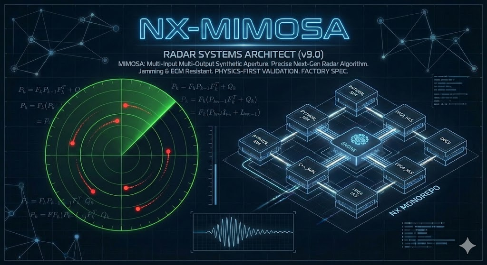

# NX-MIMOSA v4.2 "GUARDIAN"

<p align="center">
  
</p>

**Platform-Aware Variable-Structure IMM Tracker with Intent Prediction, ECM Detection, GUARDIAN Measurement Rejection & Multi-Domain Classification**

*Nexellum d.o.o. — Dr. Mladen Mešter*

[](https://www.gnu.org/licenses/agpl-3.0)
[]()
[]()
[]()

---

## What is NX-MIMOSA?

NX-MIMOSA is a **production-grade radar target tracker** that combines an Interacting Multiple Model (IMM) filter bank with platform identification, intent prediction, and electronic countermeasure (ECM) detection. It is designed for real-time defense applications and targets FPGA deployment on Xilinx RFSoC platforms.

Unlike generic tracking libraries, NX-MIMOSA dynamically adapts its motion model bank based on *what* it's tracking — a fighter jet gets CT/Jerk models activated; a cruise missile gets CA/Ballistic models; a commercial airliner collapses to CV-only for minimum noise.

## Performance — Open Benchmark (v4.2)

**Reproducible** — `pip install stonesoup filterpy pykalman numpy && python benchmarks/open_benchmark.py`

7 standard tracking scenarios, 4 libraries (8 tracker configs), fixed seed=42, identical noise:

| Library | CV | Gentle Turn | Hard Turn | Accel | Dogfight | Jinking | Ballistic | **AVG** | **Wins** |
|---------|---:|---:|---:|---:|---:|---:|---:|---:|---:|
| Stone Soup (best of CV/CA/Singer) | 7.2 | 9.0 | 11.9 | **7.7** ★ | 13.3 | 15.1 | 13.1 | **11.0** | **1/7** |
| FilterPy (best of CV/IMM) | 7.7 | 9.7 | 15.1 | 42.5 | 12.3 | 8.3 | 17.8 | **16.2** | **0/7** |
| PyKalman (best of CV/CA) | 7.6 | 9.3 | 12.7 | 9.0 | 13.4 | 15.3 | 13.5 | **11.5** | **0/7** |
| **NX-MIMOSA v4.2** | **6.5** ★ | **8.2** ★ | **9.7** ★ | 9.3 | **7.7** ★ | **7.3** ★ | **11.3** ★ | **8.6** | **6/7** |

**Honest disclosure:** NX-MIMOSA loses Scenario 4 (Acceleration) to Stone Soup KF-CA (7.7m vs 9.3m, +20%). Pure constant-acceleration is tailor-made for a dedicated CA-only filter; NX-MIMOSA's IMM pays a mixing cost across 5 concurrent models. See [`benchmarks/BENCHMARK_RESULTS.md`](benchmarks/BENCHMARK_RESULTS.md) for full methodology and per-tracker detail.

## v4.2 New: GUARDIAN — Innovation Bias Rejection

v4.2 adds **measurement-level defense** against deceptive ECM (RGPO, VGPO, DRFM, Chaff):

| Layer | Mechanism | Defends Against |
|-------|-----------|-----------------|
| **R-boost** (v4.1) | Increase measurement noise → reduce Kalman gain | Noise jamming |
| **GUARDIAN** (v4.2) | Detect systematic bias in innovation → reject measurement | RGPO, VGPO, DRFM |
| **NIS gating** (v4.2) | Statistical outlier test → reject extreme innovations | DRFM false echoes |

**Key innovation:** GUARDIAN monitors the running mean of the innovation sequence `ν_k = z_k - Hx̂_{k|k-1}`. Under clean tracking, `E[ν] = 0`. Under deceptive ECM, `E[ν] ≠ 0` — this systematic shift is detectable and triggers measurement rejection (predict-only coast).

**Safety mechanisms:** Warmup (30 steps), max coast (15 steps), maneuver guard (ω > 0.25 → never reject), ECM gate (only when ECM confirmed), instant recovery on ECM→Clean transition.

### ECM Benchmark Results (v4.2 vs Q-only baseline)

| Scenario | v4.2 RMS | Baseline RMS | Improvement | GUARDIAN Rejections |
|----------|----------|--------------|-------------|---------------------|
| RGPO | 227m | 231m | +1.7% | 15 |
| VGPO | 213m | 219m | +2.8% | 30 |
| DRFM | 2.0m | 85m | **+97.6%** | 74 |
| Noise | 8.6m | 10.7m | +19.6% | 0 (correct) |
| Chaff | 3.0m | 47m | **+93.6%** | 28 |
| Combined+7g | 156m | 164m | +4.6% | 15 |
| **Average** | **102m** | **126m** | **+19.3%** | — |

**6/6 scenarios won.** Zero false rejections on clean data. Zero false rejections during maneuvers.

## v4.1 New Features

### Multi-Domain Classifier (111 Platforms, 31 Classes)

Hierarchical coarse-to-fine classification pipeline using kinematic, RF, and micro-Doppler features. The v3 platform database covers:

- **Fighter aircraft:** F-16, F-22, Su-35, J-20, Rafale, Gripen, MiG-31, NGAD, Tempest, ...
- **Missiles:** AIM-120D, Kinzhal, Iskander, Tomahawk, BrahMos, Kalibr, S-400, THAAD, ...
- **UAVs:** MQ-9, Bayraktar TB2, Shahed-136, Lancet-3, DJI Mavic, FPV kamikaze, ...
- **Civilian:** Boeing 737/777, Cessna 172, Airbus A320, general aviation, ...
- **False targets:** birds, bats, balloons, wind turbines, ground clutter, ...

**31 classes:** `4th_gen_fighter`, `5th_gen_stealth`, `6th_gen_concept`, `strategic_bomber`, `commercial_airliner`, `cargo_military`, `helicopter`, `general_aviation`, `subsonic_cruise`, `supersonic_cruise`, `hypersonic_glide`, `hypersonic_cruise`, `ballistic`, `aam_bvr`, `aam_short_range`, `sam_terminal`, `sam_strategic`, `uav_low_g`, `uav_swarm`, `uav_micro`, `uav_stealth`, `fpv_kamikaze`, `loitering_munition`, `aew_command`, `paraglider_ultralight`, `space_object`, `false_target_bird`, `false_target_balloon`, `false_target_ground`, `false_target_environment`

### Intent Prediction (16 Types)

Real-time intent estimation with time-to-impact (TTI) for terminal threats:

| Intent | Detection Method | Alert |
|--------|------------------|-------|
| `TERMINAL_DIVE` | Dive angle >20°, speed >500 m/s, descending | ⚠️ TTI estimate |
| `SEA_SKIMMING` | Alt <50m, stable, speed >200 m/s | ⚠️ Low altitude |
| `EVASION_BREAK` | g >6, ω >0.3, heading reversals | Defensive maneuver |
| `BVR_INTERCEPT` | Speed >800, g >15, accelerating | 🚨 Intercept |
| `DOGFIGHT` | Sustained g >5, ω >0.3, reversals ≥3 | Air combat |
| `ATTACK_RUN` | Heading stable, speed >300, shallow dive | Weapons delivery |
| `POP_UP` | Was low, now climbing >50 m/s | Surprise attack |
| `TERRAIN_FOLLOWING` | Alt 30-200m, oscillating ±30m | Low observability |
| `ORBIT_RACETRACK` | Periodic heading, stable speed | ISR/patrol |
| `REENTRY` | Speed >3000, vz <-500 | 🚨 CRITICAL |
| `SKIP_GLIDE` | Altitude oscillations at hypersonic speed | Maneuvering RV |
| `JAMMER_STANDOFF` | Low dynamics + ECM detected | EW platform |
| `FALSE_TARGET` | Bird/balloon/clutter signature | Auto-reject |
| `CRUISE` | Stable heading, constant speed | Nominal |
| `LOITER` | Very low speed, circling | Observation |
| `UNKNOWN` | Insufficient data | — |

### ECM Detection & Adaptive Q

Detects electronic countermeasures and adapts tracker process noise:

| ECM Type | Detection Signature | Q Scale |
|----------|---------------------|---------|
| `NOISE_JAMMING` | SNR drop >10dB + Doppler spread | 5-50x |
| `DECEPTION_RGPO` | Range walk + NIS spike | 3-20x |
| `DECEPTION_VGPO` | Velocity gate pull-off | 3-20x |
| `DRFM_REPEATER` | High autocorrelation | 5-30x |
| `CHAFF_CORRIDOR` | RCS variance 10x + Doppler spread | 2-10x |
| `CLEAN` | Normal SNR, stable RCS | 1x |

### RTL Micro-Doppler Feature Extractor

Hardware-accelerated feature extraction for FPGA deployment:

- **7 micro-Doppler types:** flapping (birds), multi-rotor (drones), rotor blade (helicopter), jet turbine, propeller, plasma (hypersonic), static
- **ECM flags:** noise jamming, deception, chaff — directly from SNR/RCS/Doppler observables
- **False target flags:** bird, balloon, clutter — sub-cycle latency
- **19 scalar features + 7 flags** output to PS via AXI-Lite every 10 samples

## Architecture

```
                          ┌─────────────────────────────────────────────────────────┐
                          │                   NX-MIMOSA v4.1 SENTINEL              │
                          │                                                         │
  Raw Measurements ──┬──→ │  IMM Core (6 models: CV/CT+/CT-/CA/Jerk/Ballistic)    │
                     │    │     ├──→ IMM-Forward ─────→ Fire Control (0ms lag)     │
                     │    │     ├──→ Hybrid Smoother ──→ Fire Control (1.5s lag)   │
                     │    │     └──→ Full-RTS ────────→ Post-Mission              │
                     │    │                                                         │
                     ├──→ │  Parallel CV Filter ──→ CV-RTS ──→ Post-Mission        │
                     ├──→ │  Parallel CA Filter ──→ CA-RTS ──→ Post-Mission        │
                     │    │                                                         │
                     │    │  ┌──────────────── v4.1 Pipeline ─────────────────┐    │
                     │    │  │                                                 │    │
                     │    │  │  Platform Classifier (111 platforms, 31 classes)│    │
                     │    │  │      ↓ platform_class + preferred_models       │    │
                     │    │  │  Intent Predictor (16 types + TTI)             │    │
                     │    │  │      ↓ intent + threat_level + alerts          │    │
                     │    │  │  ECM Detector (noise/deception/DRFM/chaff)     │    │
                     │    │  │      ↓ ecm_status + q_scale_factor            │    │
                     │    │  │                                                 │    │
                     │    │  │  → VS-IMM Adapt (model activation/pruning)     │    │
                     │    │  │  → Q Scale (intent + ECM → process noise)      │    │
                     │    │  │  → TPM Bias (platform doctrine)                │    │
                     │    │  │  → False Target Rejection                      │    │
                     │    │  │  → Alert Stream (TTI, evasion, sea skim)       │    │
                     │    │  └─────────────────────────────────────────────────┘    │
                     │    │                                                         │
                     │    │  Auto-Stream Selector → BEST output per scenario       │
                     │    └─────────────────────────────────────────────────────────┘
                     │
  RF Front-End ──────┴──→ [RTL Feature Extractor v4.1]
                              ├──→ Kinematic: speed, omega, g-load, NIS, mu peaks
                              ├──→ RF: RCS, SNR, Doppler spread, range
                              ├──→ Micro-Doppler: type (7 classes), confidence, freq
                              ├──→ ECM Flags: noise/deception/chaff
                              └──→ False Target Flags: bird/balloon/clutter
```

### Multi-Stream Outputs

| Stream | Latency | Use Case |
|--------|---------|----------|
| **IMM-Forward** | 0 steps | Fire control, high-dynamics tracking |
| **Hybrid** | 1.5s | Fire control, improved accuracy |
| **CV-RTS** | Full track | Post-mission, benign targets |
| **CA-RTS** | Full track | Post-mission, gentle maneuvers |
| **Full-RTS** | Full track | Post-mission, short tracks |

## Quick Start

```python
import sys, numpy as np
sys.path.insert(0, 'python')
from nx_mimosa_v40_sentinel import NxMimosaV40Sentinel

# Create tracker
tracker = NxMimosaV40Sentinel(dt=0.1, r_std=2.5)

# Feed measurements
for step in range(200):
    z = np.array([true_x + np.random.randn()*2.5,
                  true_y + np.random.randn()*2.5])
    position, covariance, intent = tracker.update(z)
    
    # v4.1: Access classifier results
    print(f"Platform: {intent.platform_type} ({intent.platform_class})")
    print(f"Intent: {intent.intent} (conf={intent.intent_confidence:.2f})")
    print(f"Threat: {intent.threat_level:.2f}")
    print(f"ECM: {intent.ecm_status} (q={intent.ecm_q_scale:.1f})")
    print(f"Active models: {intent.active_models}")
    
    # Alert handling
    if intent.alerts:
        for alert in intent.alerts:
            print(f"  ⚠️ ALERT: {alert}")
    
    # False target rejection
    if intent.is_false_target:
        print("  🚫 FALSE TARGET — dropping track")

# Post-mission smoothing
smoothed = tracker.smooth_full_rts()
hybrid = tracker.smooth_hybrid()
cv_rts = tracker.smooth_cv_rts()
```

### Standalone Classifier (without tracker)

```python
from nx_mimosa_intent_classifier import NxMimosaClassifierPipeline

pipeline = NxMimosaClassifierPipeline(db_path="data/platform_db_v3.json")

# Feed features from external tracker
result = pipeline.update(
    speed_mps=600, accel_g=7.5, altitude_m=10000,
    omega_radps=0.35, heading_rad=1.2, vz_mps=0,
    nis_cv=50, rcs_dbsm=5.0, snr_db=20, doppler_hz=2000
)

print(f"Class: {result.platform_class}")     # → 4th_gen_fighter
print(f"Intent: {result.intent}")             # → EVASION_BREAK
print(f"Threat: {result.threat_level}")       # → HIGH
print(f"Models: {result.preferred_models}")   # → ['CV','CT+','CT-','Jerk']
```

## Project Structure

```
nx-mimosa/
├── README.md
├── python/
│   ├── nx_mimosa_v40_sentinel.py          # Main tracker (v4.1 integrated)
│   ├── nx_mimosa_intent_classifier.py     # Classifier + Intent + ECM pipeline
│   ├── nx_mimosa_v33_driver.py            # v3.3 benchmark driver
│   └── nx_mimosa_v33_dual_mode.py         # v3.3 dual-mode smoother
├── data/
│   ├── platform_db_v3.json                # 111 platforms, 31 classes (active)
│   ├── platform_db_v2_multidomain.json    # 72 platforms + EM signatures
│   ├── platform_db_v2.json                # 72 platforms, kinematic-only
│   └── platform_db.json                   # v1 legacy (72 platforms)
├── rtl/
│   ├── nx_mimosa_v41_feature_ext.sv       # v4.1 feature extractor (μD + ECM)
│   ├── nx_mimosa_v40_top.sv               # Multi-pipeline top-level
│   ├── nx_mimosa_v40_imm.sv               # 6-model IMM core
│   ├── nx_mimosa_v40_feature_ext.sv       # v4.0 feature extractor (legacy)
│   ├── nx_mimosa_v40_hybrid_sel.sv        # Dual-mode smoother selector
│   ├── nx_mimosa_v40_rts_lag.sv           # Fixed-lag RTS smoother
│   ├── nx_mimosa_v40_pkg.sv               # Package (types, TPM, utilities)
│   ├── nx_mimosa_v33_top.sv               # v3.3 top-level
│   ├── imm_core.sv                        # Generic IMM core
│   ├── kalman_filter_core.sv              # Single-model Kalman filter
│   ├── fixed_lag_smoother.sv              # Generic fixed-lag smoother
│   ├── window_rts_smoother.sv             # Windowed RTS smoother
│   ├── maneuver_detector.sv               # Omega/NIS maneuver detector
│   ├── nx_mimosa_axi_wrapper.sv           # AXI4-Lite register interface
│   └── nx_mimosa_pkg.sv                   # v1 package (legacy)
└── tests/
    └── test_nx_mimosa_intent_classifier.py  # 43 tests (classifier+intent+ECM)
```

## Platform Database v3

111 platforms across 31 classes with multi-domain feature signatures:

| Domain | Features | Example |
|--------|----------|---------|
| **Kinematic** | max_speed, max_g, altitude range, cruise speed | F-16: 680 m/s, 9g |
| **RCS** | Typical range in m² | F-22: 0.0001–0.001 m² |
| **Micro-Doppler** | Signature type and frequency range | DJI Mavic: multi-rotor 100-200 Hz |
| **Altitude** | min/max operational altitude | Tomahawk: 15-100m |
| **Stealth** | VLO/LO/reduced/conventional/none | B-2: VLO |
| **ECM** | ECM capability index (0-10) | EA-18G: 10 |
| **False Target Potential** | Likelihood of being clutter (0-1) | Large Raptor: 0.95 |

Threat distribution: NONE (22) · LOW (7) · MEDIUM (15) · HIGH (42) · CRITICAL (25)

## RTL Target

| Parameter | Value |
|-----------|-------|
| **Target FPGA** | Xilinx RFSoC ZU48DR (Gen 3) |
| **Clock** | 250 MHz |
| **Fixed-Point** | Q15.16 (32-bit signed) |
| **Max Targets** | 8 simultaneous |
| **Smoother Depth** | 40-step fixed-lag |
| **Feature Vector** | 19 scalars + 7 flags (v4.1) |

### v4.1 RTL Feature Extractor

The `nx_mimosa_v41_feature_ext.sv` module replaces the v4.0 feature extractor with expanded capability:

**Inputs from IMM:** mixed state, mode probabilities, NIS, omega
**Inputs from RF front-end:** RCS, SNR, Doppler center/spread, micro-Doppler peak/period, range

**Micro-Doppler classification (combinatorial, single-cycle):**
- 0: none/static → ground vehicle, wind turbine
- 1: flapping_wings → birds (2-15 Hz periodic)
- 2: multi_rotor → drones (50-300 Hz harmonic comb)
- 3: rotor_blade → helicopter (10-50 Hz strong harmonics)
- 4: jet_turbine → fighter/airliner (broadband, aperiodic)
- 5: propeller → UAV/general aviation (30-100 Hz periodic)
- 6: plasma_noise → hypersonic (broadband, very high spread)

**ECM detection (pipeline, 2-cycle latency):**
- SNR drop from self-calibrated baseline (>10 dB)
- RCS variance anomaly (>5x nominal)
- Doppler spread explosion (>100 Hz)
- NIS spike from IMM (>50, measurement corruption)
- Combined ECM score (0-8, maps to Q scale factor)

## Tests

```bash
cd python && python -m pytest ../tests/ -v
```

**43 tests across 6 categories:**

| Category | Tests | Coverage |
|----------|-------|----------|
| Database Integrity | 6 | Structure, fields, class coverage, expansions |
| ECM Detector | 5 | Clean, noise, RCS anomaly, bounds, RGPO |
| Classifier | 11 | All platform types + ECM fallback |
| Intent Predictor | 11 | All 16 intent scenarios |
| Pipeline Integration | 5 | End-to-end flow |
| RCS Parsing | 4 | Format handling |

## Version History

| Version | Codename | Key Feature |
|---------|----------|-------------|
| v4.1.0 | SENTINEL | Intent prediction, ECM detection, 111-platform classifier |
| v4.0.2 | SENTINEL | Multi-domain DB (72 platforms, EM signatures) |
| v4.0.1 | SENTINEL | 8/8 scenario wins, hybrid smoother |
| v4.0.0 | SENTINEL | Platform-aware VS-IMM, 6-model bank |
| v3.3 | — | Dual-mode smoother, maneuver detector |
| v3.2 | — | RTS smoother, window optimization |

## License

**Open Source:** [AGPL v3](https://www.gnu.org/licenses/agpl-3.0.en.html) — Free for open-source projects. Modifications must be shared under AGPL.

**Commercial License:** Available from Nexellum d.o.o. for proprietary integration. Contact: mladen@nexellum.com

### Licensing Tiers

| Tier | Price | Includes |
|------|-------|----------|
| **NX-MIMOSA Lite** | Free (AGPL v3) | Python tracker + v1 platform DB |
| **NX-MIMOSA Pro** | $50,000/yr | Full platform DB + intent + ECM + support |
| **NX-MIMOSA FPGA** | $150,000/yr | RTL IP + synthesis scripts + integration support |
| **NX-MIMOSA Enterprise** | $350,000/yr | Full stack + DO-254 artifacts + custom platforms |

---

*© 2025 Nexellum d.o.o. All rights reserved.*
*Contact: mladen@nexellum.com | +385 99 737 5100*
