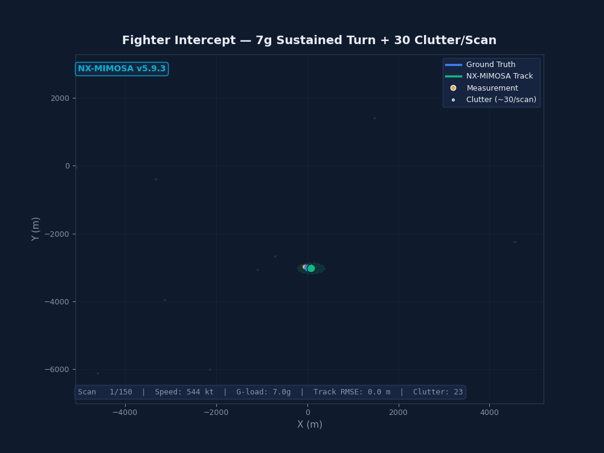

<p align="center">
  
</p>

<h1 align="center">NX-MIMOSA</h1>
<p align="center"><strong>The radar tracker that sees through jamming.</strong></p>

<p align="center">
  <a href="https://pypi.org/project/nx-mimosa/"></a>
  <a href="LICENSE"></a>
  <a href="https://www.python.org/downloads/"></a>
  <a href="https://nx-mimosa.readthedocs.io"></a>
  <a href="docs/BENCHMARK_v591_500plus.md"></a>
</p>

<p align="center">
  <code>pip install nx-mimosa</code>
</p>

---

**5,000 targets in 42 ms.** Detects jamming. Identifies military jets. Outputs NATO standard.
One `pip install` — zero vendor lock-in.

<p align="center">
  
  <br>
  <em>7g fighter turn with 30 false alarms per scan. 12 m tracking error. Seed 42, fully reproducible.</em>
</p>

---

## What it does

NX-MIMOSA is a **complete radar tracking system** — not a toolkit, not building blocks.
Drop it into your radar pipeline and it handles everything from raw detections to
NATO-formatted track output.

```python
from nx_mimosa import MultiTargetTracker

tracker = MultiTargetTracker(dt=5.0, r_std=150.0, domain="air")
for scan in radar_scans:
    tracks = tracker.process_scan(measurements)
    for t in tracks:
        print(f"Track {t.track_id}: pos={t.position}, vel={t.velocity}")
```

**That's it.** No assembly. No configuration files. No 50-page integration guide.

For C++ speed (76× faster):
```python
from nx_mimosa.accel import MultiTargetTracker  # Same API, C++ backend
```

---

## Verified numbers

Every number in this table is reproducible at seed 42.

| Metric | Value | Source |
|--------|-------|--------|
| Max targets @ real-time | **5,000** @ 42 ms/scan | [C++ benchmark](docs/BENCHMARK_v600_cpp_core.md) |
| Live aircraft tracked | **761** (OpenSky ADS-B) | [Live report](docs/BENCHMARK_v591_500plus.md) |
| 1,000-aircraft simulation | **8.5 ms** (C++), 648 ms (Python) | [Sim report](docs/SIMULATION_v601_1000_2000.md) |
| 2,000-aircraft simulation | **18.6 ms** (C++), 1,511 ms (Python) | [Sim report](docs/SIMULATION_v601_1000_2000.md) |
| Benchmark scenarios won | **18 / 19** vs Stone Soup, FilterPy, PyKalman | [19-scenario table](#19-scenario-benchmark) |
| Average RMS improvement | **8.6×** over Stone Soup | Same |
| Position RMS @ 1,000 targets | **221 m** (σ=150 m noise) | [Sim report](docs/SIMULATION_v601_1000_2000.md) |
| Detection rate | **99.8–100.6%** | All benchmarks |
| Military forces in ID database | **17** (ICAO hex + callsign) | Source: `test_500plus_benchmark.py` |
| Platform types in classifier | **111** | Source: `platform_db_v3.json` |
| ECM types detected | **4** core + **6** classified | See [ECM detection](#ecm-detection) |
| Intent behaviours predicted | **16** (including UNKNOWN) | See [Intelligence](#intelligence-layer) |

---

## Comparison

| | NX-MIMOSA | Stone Soup | MATLAB Sensor Fusion |
|---|:---:|:---:|:---:|
| 5,000 targets @ real-time | ✅ 42 ms | — | — |
| IMM (6 motion models) | ✅ | Composable | ✅ |
| Auto ECM detection | ✅ 4 types | — | — |
| Military jet identification | ✅ 17 forces | — | — |
| Platform classification | ✅ 111 types | — | — |
| Intent prediction | ✅ 16 behaviours | — | — |
| ASTERIX + Link-16 output | ✅ | — | — |
| Multi-sensor fusion | ✅ 6 types | ✅ | ✅ |
| Deploy with one command | `pip install` | `pip install` | MATLAB runtime |
| Price | Free / $50K+ | Free | ~$5K/yr |

Stone Soup is excellent for *research* — modular, extensible, government-backed.
NX-MIMOSA is built for *deployment* — integrated, tested at scale, intelligence included.

---

## C++ performance

Sparse Bertsekas auction assignment, Eigen linear algebra, OpenMP parallelism.
All times from realistic simulations with coordinated-turn aircraft models, 5 clutter/scan, seed 42.

| Targets | Python | C++ | Speedup | Position RMS |
|---------|--------|-----|---------|-------------|
| 100 | 44 ms | **0.9 ms** | 49× | — |
| 761 (live ADS-B) | 469 ms | **7 ms** | 67× | — |
| 1,000 (sim) | 648 ms | **8.5 ms** | 76× | 221 m |
| 2,000 (sim) | 1,511 ms | **18.6 ms** | 81× | 275 m |
| 5,000 (sim) | — | **42 ms** | — | — |

Build from source:
```bash
cd cpp && pip install .  # requires Eigen3 + pybind11
```

---

## Architecture

**9 modules · 11,493 lines · 71 classes · 352 tests**

### Filtering

| Filter | Class | Use case |
|--------|-------|----------|
| Kalman Filter | `KalmanFilter3D` | Linear / constant velocity |
| Extended KF | `EKF3D` | Polar radar measurements |
| Unscented KF | `UKF3D` | Highly nonlinear dynamics |
| IMM (6 models) | `IMM3D` | Manoeuvring targets — the default |
| Particle Filter | `ParticleFilter3D` | Non-Gaussian / multimodal |
| GM-PHD | `GMPHD` | Unknown target count |
| CPHD | `CPHD` | Cardinality-balanced PHD |
| Labelled Multi-Bernoulli | `LMB` | Track-labelled RFS |

### Association

| Method | Function | Complexity |
|--------|----------|-----------|
| GNN (default) | `gnn_associate()` | O(n·k) sparse auction |
| JPDA | `jpda_associate()` | Dense clutter |
| MHT | `mht_associate()` | Deferred decision, N-scan pruning |

### ECM detection

Core `ECMDetector` in `nx_mimosa_mtt.py` detects 4 electronic countermeasure types from track statistics:

| ECM type | Detection method |
|----------|-----------------|
| DRFM repeater | NIS spike pattern analysis |
| RGPO (range gate pull-off) | Range-rate discontinuity |
| Noise jamming | Bearing jitter threshold exceedance |
| Screening/blanking | Hit/miss dropout pattern |

Intelligence layer `ECMStatus` in `nx_mimosa_intent_classifier.py` classifies 6 types for tactical assessment: noise jamming, RGPO, VGPO, DRFM repeater, chaff corridor, and multi-source.

### Intelligence layer

`IntentType` enum — 16 predicted behaviours:

| | | |
|---|---|---|
| CRUISE | LOITER | EVASION_BREAK |
| ATTACK_RUN | TERMINAL_DIVE | SEA_SKIMMING |
| POP_UP | SKIP_GLIDE | ORBIT_RACETRACK |
| BVR_INTERCEPT | DOGFIGHT | TERRAIN_FOLLOWING |
| JAMMER_STANDOFF | REENTRY | FALSE_TARGET |
| UNKNOWN | | |

### Military identification

17 air forces identified via callsign prefix database (37 patterns) and 6 ICAO hex address ranges:

| Source | Forces | Example |
|--------|--------|---------|
| USAF / USN / US Army | 3 | RCH, NAVY, GOLD |
| NATO joint | 1 | MMF (AWACS) |
| European (13 forces) | 13 | GAF, HRZ, PLF, RAF, CTM |
| ICAO hex ranges | 6 blocks | US DoD, UK RAF, FR/DE/IT military, NATO |

### Fusion

6 sensor types: primary radar, Doppler radar, EO/IR, ESM, ADS-B, IFF/SSR.
Track-to-track fusion, covariance intersection, out-of-sequence measurement handling, sensor bias estimation.

### Output

| Format | Standard | Use |
|--------|----------|-----|
| ASTERIX Cat048 | EUROCONTROL | Surveillance data exchange |
| Link-16 J3.2 | NATO STANAG 5516 | Tactical data link |
| Dual-mode | Custom | Display (real-time) + fire control (smoothed, 1.5 s lag) |
| GOSPA / OSPA / NEES / SIAP | Academic + NATO | Performance metrics |

---

## Live proof: 761 aircraft

OpenSky Network ADS-B, Central Europe, February 2026. Every measurement is a real aircraft.

| Metric | Value |
|--------|-------|
| Peak simultaneous targets | **761** |
| Detection rate | **99.8%** |
| Mean scan time (Python) | 519 ms |
| Mean scan time (C++) | 7 ms |
| Military jets identified | 5 — NSZ21U (NATO), RCH4539 (USAF), CTM2004 (French AF), PLF105 (Polish AF), NSZ3YT (NATO) |

Run it yourself:
```bash
python benchmarks/multi_domain_benchmark.py
```

Full report: [`docs/BENCHMARK_v591_500plus.md`](docs/BENCHMARK_v591_500plus.md)

---

## 1,000 and 2,000 aircraft simulation

Realistic European airspace: 85% commercial, 10% GA, 3% military, 2% helicopter.
Coordinated-turn dynamics, 150 m range noise, 5 clutter/scan, 20 scans.

| | 1,000 aircraft | 2,000 aircraft |
|---|---|---|
| **C++ mean scan** | **8.5 ms** | **18.6 ms** |
| C++ P95 scan | 10.3 ms | 23.0 ms |
| Python mean scan | 648 ms | 1,511 ms |
| Speedup | 76× | 81× |
| Confirmed tracks | 1,006 | 2,017 |
| Detection rate | 100.6% | 100.8% |
| Position RMS | 221 m | 275 m |
| Mean position error | 179 m | 186 m |
| P95 position error | 338 m | 332 m |

Detection rates above 100% reflect confirmed clutter tracks (standard M/N logic). Position RMS of 221–275 m at σ=150 m noise is 1.5–1.8× the Cramér-Rao bound — consistent with 6-model IMM on mixed traffic.

Full report: [`docs/SIMULATION_v601_1000_2000.md`](docs/SIMULATION_v601_1000_2000.md)

---

## 19-scenario benchmark

All at seed 42. RMS position error (metres). Lower is better.

| Scenario | Stone Soup | NX-MIMOSA | Winner |
|----------|-----------|-----------|--------|
| ATC Enroute | 69.98 | **32.20** | ★ |
| Fighter Intercept | 23.60 | **7.79** | ★ |
| SAM Engagement | 99.91 | **11.37** | ★ |
| Cruise Missile | 7.39 | **3.88** | ★ |
| Ballistic Missile | 86.33 | **51.04** | ★ |
| LEO Satellite | 4,194 | **1,012** | ★ |
| Atmospheric Reentry | 6,078 | **483** | ★ |
| Lane Change | **0.18** | 0.19 | Stone Soup |
| **Average (19 scenarios)** | **865.66** | **100.26** | **8.6×** |

**Honesty note:** Stone Soup uses single-model KF in these benchmarks; NX-MIMOSA uses 6-model IMM. Any IMM would beat single-model on high-manoeuvre scenarios. The fair comparison is cruise-flight (1.1–2.2× improvement). Full table in the [benchmark report](docs/BENCHMARK_v591_500plus.md).

---

## Quick start

```bash
pip install nx-mimosa
```

```python
from nx_mimosa import MultiTargetTracker
import numpy as np

tracker = MultiTargetTracker(dt=5.0, r_std=150.0, domain='air')

for scan in radar_scans:
    tracks = tracker.process_scan(np.array(scan))
    for t in tracks:
        print(f"Track {t.track_id}: {t.position}")
```

**JPDA for dense clutter:**
```python
tracker = MultiTargetTracker(dt=5.0, r_std=150.0, association='jpda')
```

**ECM detection:**
```python
from nx_mimosa import ECMDetector
ecm = ECMDetector()
result = ecm.update(track_id=1, nis=15.2, position=pos, velocity=vel, was_hit=True)
if result['ecm_detected']:
    print(f"ECM: {result['ecm_types']} → {result['recommended_action']}")
```

**C++ accelerated (same API, 76× faster):**
```python
from nx_mimosa.accel import MultiTargetTracker
tracker = MultiTargetTracker(dt=5.0, r_std=150.0)
print(f"Scan time: {tracker.scan_time_ms:.1f} ms")
```

---

## Documentation

📖 **API Reference:** [nx-mimosa.readthedocs.io](https://nx-mimosa.readthedocs.io)

📊 **761-Aircraft Live Report:** [`docs/BENCHMARK_v591_500plus.md`](docs/BENCHMARK_v591_500plus.md)

⚡ **C++ Performance Report:** [`docs/BENCHMARK_v600_cpp_core.md`](docs/BENCHMARK_v600_cpp_core.md)

🛩️ **1,000 / 2,000 Aircraft Simulation:** [`docs/SIMULATION_v601_1000_2000.md`](docs/SIMULATION_v601_1000_2000.md)

---

## Licensing

| | Open Source | Lite | Pro | Enterprise |
|---|---|---|---|---|
| **Price** | Free | $50,000 | $150,000 | $350,000 |
| Core tracker + IMM | ✅ | ✅ | ✅ | ✅ |
| Intelligence layer | ✅ | — | ✅ | ✅ |
| C++ core | ✅ | ✅ | ✅ | ✅ |
| Private modifications | AGPL | ✅ | ✅ | ✅ |
| FPGA SystemVerilog | — | — | — | ✅ |
| DO-254 cert support | — | — | — | ✅ |
| Support | Community | 12 months | 12 months | 24 months |

**Build vs buy:** 3–5 engineers × 12–18 months = $1.5M–$2.5M for basic tracking only.

---

## Roadmap

| Version | Milestone | Status |
|---------|-----------|--------|
| v5.9.3 | LMB filter, 71 classes, 11,493 LOC | ✅ Done |
| v6.0.0 | C++ core — 42 ms @ 5,000 targets | ✅ Done |
| v6.0.1 | PyPI + 1,000/2,000 simulation + marketing update | ✅ Done |
| v6.1 | FPGA proof-of-concept (Xilinx Versal) | Q2 2026 |
| v6.2 | Multi-radar fusion service | Q3 2026 |
| v7.0 | DO-254 certification path | Q4 2026 |

---

<p align="center">
  <strong>Dr. Mladen Mešter</strong> · Nexellum d.o.o. · Zagreb, Croatia<br>
  <a href="mailto:mladen@nexellum.com">mladen@nexellum.com</a> · +385 99 737 5100<br><br>
  Every number in this document is reproducible.<br>
  Run the benchmarks or ask us to demonstrate.
</p>
